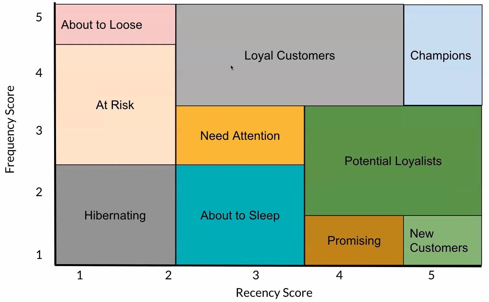

# Insiders VIP Clients

# Situation  
This project refers to an online retailer/wholesaler that sells through an e-commerce platform. The aim is to create a VIP club for important customers with access to extra perks. Customers will be selected according to the frequency and amount they buy. This program will be called “Insiders”. Using advanced data manipulation techniques, customers will be grouped(clustered) according to similarities.

# Problem
Segment customers according to shared characteristics to identify a group relevant in revenue for marketing actions.

**Solution Planning (IOT)**

**Input**  

    - Business Problem: Select the most valuable customers to join a loyalty program.  
    - Dataset: E-commerce online sales.  
**Output**  

    1.List of customers who will join the Insiders program.  
    2.Who are the people eligible to join the Insiders program?  
    3.How many customers will be part of the group?  
    4.What are characteristics of these customers?  
    5.What is the percentage of revenue contribution coming from the Insiders?  
    6.What is the expected revenue of this group for the next months?  
**Tasks**  

1. Segment customers eligible to join the Insiders program.  
    •	What are the most valuable customers?  
    •	Revenue, RFM Model, average spending, churn
    •   Cost: Items return rate
2. How many customers will be part of the group?  
•   Total number of customers vs % of Insiders Group  
3. What are the main characteristics of these customers?  
•	Clustering attributes  
4. What is the percentage of revenue contribution coming from the Insiders?  
•	Anual total revenue  
•	Insiders' revenue  
5. What is the expected revenue of this group for the next months?  
•	Insiders' LTV •	Cohort Analysis •	Timeseries (ARIMA, ARMA, Prophet)
6. What actions can the marketing team take to increase revenue?  
•	Discount  
•	Shipping  
•	Company visit  
•	Perks  

**Benchmark guide: RFM Model:**

The goal is to extract clusters that best fit the RFM(Recency, Frequency, Monetary) model.

# The jupyter notebook
---
# 1 - Data preparation
Data provided a set of features like:
- InvoicNo
- StockCode
- Description
- Quantity
- InvoiceDate
- UnitPrice
- CustomerID
- Country

Checked data, NAs, adjusted column names, checked numerical and categorical attributes. Also changed variable types.

There were many missing NAs for customer_id, in order to make data usefull for model training decided to set all transactions with customer_id as random transactions from 'unknown' customer, this way, filled NAs starting at customer_id 19.000.

There were some items with missing description as well missing customer_id, on these have opted for deleting values, since it represents less than .003% of the dataset.

Checking numerical Attributes it was possible to detect some negative values for quantity besides that found items costing 0.0. Further analysing the dataset it makes sense to assume negative quantities are returns and unity price items, are free items or administrative system imputs.

Letter were present on stock codes, like:
['POST' 'D' 'DOT' 'M' 'S' 'AMAZONFEE' 'm' 'DCGSSBOY' 'DCGSSGIRL' 'PADS' 'B' 'CRUK']
So that cohoborrates with the conclusions on the previous paragraph.

For the invoice number noticeable was the presence of letters in front of the number itself,
checking the dataframe all invoices with letters had negative quantities on the transaction it referred to.

Country list was able to tell that United Kingdom is the main market for this company at the time the data was generated, accounting for over 90% of transactions.

# 2 Data filtering

- Assumed negative quantaties implies returns.
- Created a table for returns with the thought having return data would be beneficial for the modeling.
- Filtered out products that cost less than 4p, and non-specific countries

# 3 Feature Engineering

Created features in order to test the model. However as revealed later on, the model performed better without mosf of the additional features created.

Features Created:
- Gross Revenue per customer
- Recency for customer from last purchase(days)
- Total ammount purchased by customer
- Ammount of products items purchased
- Ammount of different products purchased
- Average sales(ticket) value
- Average recency in days
- Frequency of purchases (buys once every x days
- Number of Returns
- Average Number of items a customers buy each time.
- Average Number of different items a customers buy each time.

# Exploratory Data Analysis

Since this is a clustering problem, some tests were conducted in order to find a model that would proper suit to group customers together based on feature distances. 

- PCA itself did not show clear evidence of clusters.
- UMAP the precision of the groups were not satisfatory.
- t-SNE was able to show some improvement, but not the best.

Embedding the space using RandomForestRegressor and performing a dimensionality reduction with UMAP afterwards has led to the best cluster grouping on visual inspection.

# 6 Feature Selection
Once working with the embedded space that ForestRegressor generated and applying dimensionality reduction, there is now no features to be selected.

# 7 Hyperparameter Fine-tuning
Several algorithms were checked and Silhouette Scores as well WSS compared:
- KMeans
- GMM
- Hierarchical Clustering
- DBScan

The results were compared, however for this kind of problem where we seek to find the best way to group customers while having a proper number of clusters that is manageable for business teams, we opted for a K of 11. It is now the best, however it is still good as it gives an acceptable Silhoutte Score and WSS. On this first cycle KMeans was chosen for the final model, however Hierarchical Clustering seems like the preferable choice for a next review cycle on this project.

# 8 Model Training
KMeans model with k = 11 clusters, embedded space(ForestRegressor followed by UMAP reduction).
WSS Value was 17223.31 while Silhoutte Score 0.6153.

# 9 Cluster Analysis

Looking at the final results for the groups, it makes sense:

